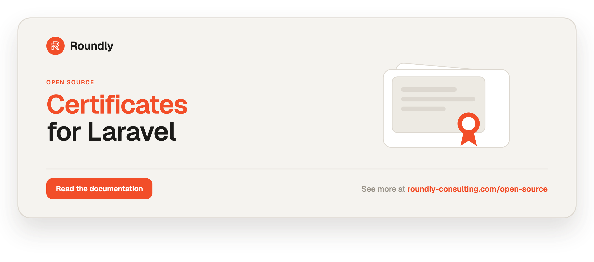

<!-- roundly-hero:start -->
<p align="center">
  <a href="https://roundly-consulting.com/open-source/docs/certificates-for-laravel?utm_source=github&utm_medium=readme&utm_campaign=open-source&utm_content=certificates-for-laravel">
    
  </a>
</p>
<!-- roundly-hero:end -->

<!-- roundly-badges:start -->
<p align="center">
  <a href="https://packagist.org/packages/roundly-consulting/certificates-for-laravel"></a>
  <a href="https://github.com/roundly-consulting/certificates-for-laravel/actions/workflows/run-tests.yml"></a>
  <a href="https://github.com/roundly-consulting/certificates-for-laravel/actions/workflows/fix-php-code-style-issues.yml"></a>
  <a href="https://donate.stripe.com/dRmeVe8FX5PF1Qd9pXcEw00"></a>
  <a href="https://www.patreon.com/cw/roundly"></a>
  <a href="https://roundly-consulting.com/support-us?utm_source=github&utm_medium=readme&utm_campaign=open-source&utm_content=certificates-for-laravel#crypto"></a>
</p>
<!-- roundly-badges:end -->

# Certificates for Laravel

Request, track, and renew the TLS certificates for your domains — directly from Laravel.

The package gives you a framework-native API to **issue**, **list**, **find**, **renew** and **revoke** TLS
certificates, plus a local **registry** (an Eloquent model) that records every certificate's
status and expiry so you can answer "which certificates expire in 14 days?" with an ordinary
query.

Pluggable providers cover the common deployment shapes:

- **`acme`** — a native, pure-PHP [ACME v2](https://datatracker.ietf.org/doc/html/rfc8555) client
  that obtains certificates directly from Let's Encrypt (or any ACME CA), with a pluggable
  challenge-solver contract (HTTP-01 included; DNS-01 as a documented extension point). No
  third-party crypto or HTTP SDK — the JWS, signatures, codecs, JWK and X.509 parsing come from
  [crypto-for-laravel](https://github.com/roundly-consulting/crypto-for-laravel), the CSR from
  `ext-openssl`, and the transport from Laravel's HTTP client.
- **`kubernetes`** — talks to the Kubernetes API directly (no SDK) to read
  [cert-manager](https://cert-manager.io) certificates and patch an Ingress with TLS hosts.
- **`filesystem`** — reads/writes PEM material on a Laravel `Storage` disk and can self-sign for
  local development.
- **`null`** / **`array`** — an inert no-op and an in-memory backend powering `Certificates::fake()`.

On top of issuance it adds **multi-domain / SAN + wildcard** certificates, **expiry monitoring
routed through [alerts-for-laravel](https://github.com/roundly-consulting/alerts-for-laravel)**,
cache-aware **status reports**, **multi-tenant** connection targeting, and **macroable** services.
The provider contract is public, so you can plug in your own backend.

## Integrates with

- **[crypto-for-laravel](https://github.com/roundly-consulting/crypto-for-laravel)** (hard
  dependency) — every cryptographic primitive the ACME client needs is the shared, audited one:
  the flattened JWS each request is signed with, RS256/ES256/ES384 signing (including the DER → raw
  `r‖s` conversion Let's Encrypt requires), account key generation and loading, strict base64url,
  the account's **JWK and its RFC 7638 thumbprint** (`Crypto\Jose\Jwk` — the curve label and the
  coordinate width come from the key, so a P-384 account key is never advertised as a P-256 one),
  and **X.509 parsing** (`Crypto\X509\Certificate`), which reads every issued certificate's
  subject, SANs, validity, serial and fingerprint.

  What stays here is ACME protocol and every **trust decision**: the `jwk`-vs-`kid` signing mode,
  the account kid, the challenge solvers, the CSR (crypto has no enrollment API by design), and
  what an expiring certificate means. Crypto reports certificate facts; this package decides what
  to do about them.
- **[alerts-for-laravel](https://github.com/roundly-consulting/alerts-for-laravel)** (hard
  dependency) — certificate expiry and lifecycle failures (expired / revoked / failed) are surfaced
  as first-class health checks, so they inherit alert dedup/throttle, escalation, silence windows,
  run history, and the `/health` surface. See [Expiry monitoring](#expiry-monitoring-via-alerts).
- **[enums-for-laravel](https://github.com/roundly-consulting/enums-for-laravel)** (hard
  dependency) — `Enums\CertificateStatus` adopts the shared `Helpers` trait, exposing
  `values()`, `labels()`, `options()`, `toOptions()`, `validationRule()`, `tryFromLabel()` and
  more alongside its domain methods (`color()`, `isActive()`, `isTerminal()`, `canTransitionTo()`).

## Requirements

- PHP `^8.4` with the `openssl` and `json` extensions
- Laravel `^12.0` or `^13.0`
- `roundly-consulting/crypto-for-laravel`, `roundly-consulting/alerts-for-laravel`,
  `roundly-consulting/enums-for-laravel`, and `roundly-consulting/package-toolkit-for-laravel`
  (pulled in automatically as dependencies)

## Installation

```bash
composer require roundly-consulting/certificates-for-laravel
```

The service provider and the `Certificates` facade alias are auto-discovered.

Publish and run the migrations to enable the local registry (recommended — without it the package
still issues certificates, but records nothing and cannot track expiry). The package's migrations
are **not loaded automatically**: publish them first, then migrate.

```bash
php artisan vendor:publish --tag="certificates-migrations"
php artisan migrate
```

They land in your `database/migrations` as timestamped files you own, so they order against your
own migrations and republishing overwrites in place instead of duplicating them.

Optionally publish the config and translations:

```bash
php artisan vendor:publish --tag="certificates-config"
php artisan vendor:publish --tag="certificates-translations"
```

## Configuration

The published config lives at `config/certificates.php`.

### Keys

| Key | Type | Default | Env |
|---|---|---|---|
| `default` | string | `kubernetes` | `CERTIFICATES_DRIVER` |
| `connection` | string\|null | `null` | `CERTIFICATES_DB_CONNECTION` |
| `model` | class-string | `RoundlyConsulting\Certificates\Models\Certificate` | — |
| `table` | string | `certificates` | — |
| `key_type` | string | `bigint` | `CERTIFICATES_KEY_TYPE` |
| `renewal.threshold_days` | int | `21` | `CERTIFICATES_RENEW_THRESHOLD_DAYS` |
| `renewal.queue` | string\|null | `null` | `CERTIFICATES_RENEW_QUEUE` |
| `name_prefix` | string | `generated-tls-` | `CERTIFICATES_NAME_PREFIX` |
| `lock.name` | string | `certificates:generate` | `CERTIFICATES_LOCK_NAME` |
| `lock.locked_for_seconds` | int | `5` | `CERTIFICATES_LOCK_SECONDS` |
| `status_cache.enabled` | bool | `true` | `CERTIFICATES_STATUS_CACHE` |
| `status_cache.store` | string\|null | `null` | `CERTIFICATES_STATUS_CACHE_STORE` |
| `status_cache.ttl` | int | `300` | `CERTIFICATES_STATUS_CACHE_TTL` |
| `alerts.enabled` | bool | `false` | `CERTIFICATES_ALERTS` |
| `alerts.notifiable` | string\|null | `null` | `CERTIFICATES_ALERTS_NOTIFIABLE` |
| `alerts.thresholds.warning_days` | int | `30` | `CERTIFICATES_ALERTS_WARNING_DAYS` |
| `alerts.thresholds.critical_days` | int | `7` | `CERTIFICATES_ALERTS_CRITICAL_DAYS` |
| `alerts.channels` | list | `['mail']` | — |
| `alerts.register_check` | bool | `false` | `CERTIFICATES_ALERTS_REGISTER_CHECK` |
| `drivers.acme.directory` | string | Let's Encrypt prod directory | `CERTIFICATES_ACME_DIRECTORY` |
| `drivers.acme.contact` | string\|null | `null` | `CERTIFICATES_ACME_CONTACT` |
| `drivers.acme.account.key_type` | string | `EC` | `CERTIFICATES_ACME_KEY_TYPE` |
| `drivers.acme.account.disk` | string | `local` | `CERTIFICATES_ACME_ACCOUNT_DISK` |
| `drivers.acme.account.key_path` | string | `acme/account.pem` | `CERTIFICATES_ACME_ACCOUNT_KEY` |
| `drivers.acme.account.auto_register` | bool | `true` | `CERTIFICATES_ACME_AUTO_REGISTER` |
| `drivers.acme.solver` | string\|null | `null` | `CERTIFICATES_ACME_SOLVER` |
| `drivers.acme.http.disk` | string | `local` | `CERTIFICATES_ACME_HTTP_DISK` |
| `drivers.acme.http.path` | string | `acme-challenge` | `CERTIFICATES_ACME_HTTP_PATH` |
| `drivers.acme.store.disk` | string | `local` | `CERTIFICATES_ACME_STORE_DISK` |
| `drivers.acme.store.path` | string | `certificates` | `CERTIFICATES_ACME_STORE_PATH` |
| `drivers.acme.poll.attempts` | int | `30` | `CERTIFICATES_ACME_POLL_ATTEMPTS` |
| `drivers.acme.poll.seconds` | int | `2` | `CERTIFICATES_ACME_POLL_SECONDS` |
| `drivers.acme.verify` | bool\|string | `true` | `CERTIFICATES_ACME_VERIFY` |
| `drivers.filesystem.disk` | string | `local` | `CERTIFICATES_FS_DISK` |
| `drivers.filesystem.path` | string | `certificates` | `CERTIFICATES_FS_PATH` |
| `drivers.filesystem.self_signed` | bool | `false` | `CERTIFICATES_FS_SELF_SIGNED` |
| `drivers.filesystem.self_signed_days` | int | `90` | `CERTIFICATES_FS_SELF_SIGNED_DAYS` |
| `drivers.kubernetes.base_url` | string | `https://kubernetes.default.svc` | `CERTIFICATES_K8S_BASE_URL` |
| `drivers.kubernetes.token` | string\|null | `null` | `CERTIFICATES_K8S_TOKEN` |
| `drivers.kubernetes.token_path` | string\|null | in-cluster SA token path | `CERTIFICATES_K8S_TOKEN_PATH` |
| `drivers.kubernetes.ca_path` | string\|false\|null | in-cluster SA CA path | `CERTIFICATES_K8S_CA_PATH` |
| `drivers.kubernetes.namespace` | string | `default` | `CERTIFICATES_K8S_NAMESPACE` |
| `drivers.kubernetes.issuer` | string | `letsencrypt` | `CERTIFICATES_K8S_ISSUER` |
| `drivers.kubernetes.issuer_kind` | string | `ClusterIssuer` | `CERTIFICATES_K8S_ISSUER_KIND` |
| `drivers.kubernetes.ingress.name` | string\|null | `null` | `CERTIFICATES_K8S_INGRESS_NAME` |
| `drivers.kubernetes.ingress.class` | string | `nginx` | `CERTIFICATES_K8S_INGRESS_CLASS` |
| `drivers.kubernetes.service.name` | string\|null | `null` | `CERTIFICATES_K8S_SERVICE_NAME` |
| `drivers.kubernetes.service.port` | int | `80` | `CERTIFICATES_K8S_SERVICE_PORT` |
| `drivers.null` | array | `[]` | — |
| `drivers.array` | array | `[]` | — |

`default` selects which driver is used when none is named. The `null` driver is an inert no-op for
local/dev; the `array` driver is an in-memory backend used by the test fake.

`key_type` is the column type of the polymorphic `certifiable` owner — `bigint`, `uuid` or `ulid`
(anything else falls back to `bigint`). The migration reads it, so set it before you migrate, and
every model you attach certificates to must share it. It is unrelated to the ACME account key
algorithm, `drivers.acme.account.key_type` (`EC` / `RSA`).

`lock.*` configures the cache lock taken **per certificate** (`{lock.name}:{certificate name}`)
while it is provisioned; other certificates are never blocked. While the lock is held, `issue()`
throws `Exceptions\ProvisioningInProgressException` (the registry row is left untouched) and
`generate()` returns `false`. `lock.locked_for_seconds` is the lock's safety expiry — keep it above
your slowest issuance (an ACME order polls for up to `poll.attempts × poll.seconds`). The Kubernetes driver
authenticates with the standard in-cluster service-account token and CA bundle by default — set
`token` directly (or point `token_path` at a mounted file). `ca_path` is the CA bundle the API
server's certificate is verified against; `null` (or empty) verifies against the system CA bundle
instead, and only `false` (`CERTIFICATES_K8S_CA_PATH=false`) disables TLS verification — not
recommended. `drivers.acme.verify` works the same way: a bundle path, `true`/`null` for the system
bundle, or `false`.

## Usage

### Issue and track a certificate

```php
use RoundlyConsulting\Certificates\Facades\Certificates;

$certificate = Certificates::issueIfMissing('app.example.com');

$certificate->status;            // RoundlyConsulting\Certificates\Enums\CertificateStatus::Issued
$certificate->expires_at;        // CarbonImmutable|null
$certificate->expiresWithin(14); // bool
$certificate->daysUntilExpiry(); // int|null
```

### Fluent builder

```php
$certificate = Certificates::for('shop.tenant.com')
    ->using('kubernetes')
    ->validForDays(90)      // the recorded expiry only when the driver cannot report one
    ->meta(['tenant' => '7'])
    ->owner($tenant)        // attaches via the HasCertificates morph
    ->issue();
```

The builder also exposes `->issueIfMissing()`, `->exists()`, `->status()`, `->find()`,
`->statusReport()`, and `->fresh()` — plus the lifecycle verbs below for the domain's registry row.

The issuer and namespace are **driver configuration**, not per-certificate options: the
`kubernetes` driver always uses `drivers.kubernetes.issuer` / `issuer_kind` / `namespace`. For a
second issuer or namespace, register another driver with `Certificates::extend()` and pick it with
`using()`.

`issue()` records what the driver reports. When the backend reports the certificate issued, the
row is `Issued` with the reported expiry, issuer, serial and fingerprint (`validForDays`, default
90, fills in only when the driver reports no expiry). When it reports the certificate failed,
expired or revoked, the row is `Failed`, `CertificateFailed` fires and the exception is rethrown.
cert-manager issues **asynchronously**, so on `kubernetes` a first `issue()` patches the Ingress
and returns the row still `Requested` (cert-manager has not created or finished the Certificate
yet). Run `certificates:sync` (or `Certificates::sync('kubernetes')`) to record the outcome once
it is `Ready`.

Domains are case-insensitive: `App.Example.com` and `app.example.com` are the same certificate, one
registry row and one secret name. Re-issuing a domain whose row was pruned restores that row as a
fresh registration.

### Renew, revoke and expire

Every lifecycle verb takes a registry `Certificate` or a domain (its most recent row), flat or
through the `for()` handle. An unknown domain, or a status that can't make the move (e.g. renewing
a revoked certificate), throws `CertificateException` — `renewLater()` included: it checks the
status before it queues anything.

```php
Certificates::renew('app.example.com');                  // now, through the certificate's own driver
Certificates::renewLater('app.example.com');             // queue RenewCertificateJob (renewal.queue)
Certificates::revoke($certificate, 'key compromise');    // Revoked + CertificateRevoked
Certificates::expire('app.example.com');                 // Expired + CertificateExpired

Certificates::for('app.example.com')->renew();           // same verbs on the domain handle
Certificates::for('app.example.com')->using('acme')->revoke(); // only the acme row is touched

Certificates::expiring(14);                   // Collection<int, Certificate>, soonest first
Certificates::renewDue();                     // renew everything inside renewal.threshold_days → RenewalReport
Certificates::renewDue(7, queue: true);       // …or queue each one
Certificates::sync('kubernetes');             // pull live provider state into the registry → int
Certificates::prune(30);                      // soft-delete stale expired/failed/revoked rows → int
```

A renewal re-provisions every domain the certificate covers (a SAN certificate keeps all its
hosts) and is proven by the provider's own report: a status that is not live, or the very same
certificate (same fingerprint, e.g. imported material nobody replaced), is a failed renewal. A
failed renewal moves the row to `Failed` and fires `CertificateFailed` before the exception is
rethrown, so it raises an alert instead of sitting in `Renewing`. `Failed` is not a dead end: a
failed row can be renewed again, and `expiring()` / `renewDue()` / `certificates:renew` keep
retrying it while its live certificate runs out. `revoke()` records the revocation in the
registry; it does not contact the CA or the cluster.

`renewDue()` attempts every due certificate on its own: one failure never stops the rest. It
returns a `DataTransferObjects\RenewalReport` listing each certificate's outcome — `renewed`,
`queued` (with `queue: true`) and `failed` (`RenewalFailure`: the certificate plus the exception,
`reason()` for its message). Each failure is also passed to your exception handler. A failed inline
renewal is `Failed` + `CertificateFailed` as above; a failed dispatch leaves the row untouched, so
the next run retries it.

```php
$report = Certificates::renewDue();

if ($report->hasFailures()) {
    foreach ($report->failed as $failure) {
        logger()->warning("Renewal failed for {$failure->certificate->domain}: {$failure->reason()}");
    }
}

$report->renewedDomains();   // ['a.example.com', …]; also queuedDomains(), failedDomains(), count(), isEmpty()
```

### Without the facade

The facade is sugar over `CertificatesManager`. Inject it for the same API, or call an action
directly:

```php
use RoundlyConsulting\Certificates\Actions\RevokeCertificateAction;
use RoundlyConsulting\Certificates\CertificatesManager;
use RoundlyConsulting\Certificates\DataTransferObjects\IssueCertificateData;

final class SiteCertificates
{
    public function __construct(private CertificatesManager $certificates) {}

    public function launch(string $domain): void
    {
        $this->certificates->issue(IssueCertificateData::make($domain));
        $this->certificates->for($domain)->renewLater();
    }
}

// The raw use case, e.g. from your own action:
app(RevokeCertificateAction::class)->execute($certificate, 'key compromise');
```

The actions are `IssueCertificateAction`, `RenewCertificateAction`, `RenewDueCertificatesAction`,
`RevokeCertificateAction`, `ExpireCertificateAction`, `SyncCertificatesAction` and
`PruneCertificatesAction`. The `certificates()` helper returns the same manager.

### ACME / Let's Encrypt

The `acme` driver obtains real certificates from any ACME v2 CA in pure PHP. Point it at a CA
directory (Let's Encrypt production by default; use the staging URL while testing), give it a
contact email, and issue:

```php
// config/certificates.php → 'default' => 'acme', or:
Certificates::for('app.example.com')->using('acme')->issue();
```

The default **HTTP-01** solver writes the challenge token to the configured Storage disk; your app
must serve it at `/.well-known/acme-challenge/{token}`. Issued material (leaf, private key, chain)
is stored on the configured store disk. The account key is generated and persisted automatically on
first use (`account.auto_register`): `key_type` `EC` mints a P-256 key, `RSA` a 2048-bit one. An
account key you place on the disk yourself is used as-is — EC **P-256 and P-384** are both accepted,
and each is signed under its own algorithm (`ES256` / `ES384`), which is what the CA expects.

The account itself is recorded **per CA directory**, next to the key
(`{key_path}.{sha256(directory)}.kid`), and bound to the key it was registered with. Switching
`directory` from Let's Encrypt staging to production registers a production account on the next
issue instead of replaying the staging account URL there, switching back reuses the staging one,
and a replaced account key re-registers rather than signing under its predecessor's account.
Re-registering an already-known key is safe — the CA answers with the existing account.

**DNS-01** is a documented extension point. Extend `ChallengeSolvers\DnsChallengeSolver`, implement
`publishRecord()` / `removeRecord()` against your DNS provider, and register its class name via
`drivers.acme.solver` (`CERTIFICATES_ACME_SOLVER`). It is resolved from the container, so it can
take constructor dependencies:

```php
use RoundlyConsulting\Certificates\ChallengeSolvers\DnsChallengeSolver;

final class Route53Solver extends DnsChallengeSolver
{
    protected function publishRecord(string $name, string $value): void { /* upsert TXT */ }
    protected function removeRecord(string $name, string $value): void { /* delete TXT */ }
}

// config/certificates.php → 'drivers' => ['acme' => ['solver' => Route53Solver::class, …]]
```

That one key is all it takes: the solver's own `type()` picks the challenge answered (`dns-01` for a
`DnsChallengeSolver`, `http-01` for the shipped default), so there is no separate challenge-type
setting to keep in step. `$name` is the `_acme-challenge.{domain}` TXT record name and `$value` its
content.

### Filesystem provider

The `filesystem` driver manages PEM material on a Storage disk. It is **not** a CA: it reads
material produced elsewhere (e.g. an external ACME run) and, with `self_signed` enabled, generates
self-signed certificates for local development and tests.

It never reports work it did not do. Without `self_signed`, issuing a name with no stored PEM
throws `CertificateException` (import the material first; imported material is registered with its
real expiry), and renewing material nobody replaced fails as "not renewed". With `self_signed`,
every issue and renewal mints fresh material — a renewal really moves the expiry — but a PEM a real
CA issued is never overwritten.

```php
config(['certificates.drivers.filesystem.self_signed' => true]);
Certificates::for('app.test')->using('filesystem')->issue();
```

### Multi-domain (SAN) and wildcard certificates

Issue one certificate covering several domains by passing an array to `for()`, or appending SANs
fluently with `alsoFor()`. Wildcards are supported, but on the `acme` driver only over **DNS-01**:
CAs (Let's Encrypt included) never offer HTTP-01 for a `*.` name, so register a DNS-01 solver first
(see [ACME / Let's Encrypt](#acme--lets-encrypt)). With the default HTTP-01 solver a wildcard order
fails with an `AcmeException` that says so.

```php
// requires a DnsChallengeSolver in drivers.acme.solver
Certificates::for(['app.example.com', '*.app.example.com'])->using('acme')->issue();

Certificates::for('example.com')
    ->alsoFor('www.example.com', 'api.example.com')
    ->using('acme')
    ->issue();
```

The primary domain is stored on the `domain` column; the full SAN list is stored on the additive
`domains` JSON column. Find a certificate that covers a host with the `coveringDomain` scope:

```php
Certificate::query()->coveringDomain('www.example.com')->first();
```

Providers that implement `Contracts\ProvisionsMultipleDomains` (`acme`, `filesystem`, `kubernetes`,
`array`) receive the full domain list; others fall back to the primary domain.

### Live status reports (cached)

`statusReport()` returns a live `CertificateStatusReport` from the provider, cached per the
`status_cache.*` config. Pass `fresh: true` (or call `->fresh()` on the builder) to bypass the cache
and refresh it:

```php
Certificates::statusReport('app.example.com');               // cached
Certificates::statusReport('app.example.com', fresh: true);  // bypass + refresh
Certificates::for('app.example.com')->fresh()->statusReport();
```

`issue()` and `renew()` drop that certificate's cached report, so the next `statusReport()` reads
the new state instead of the one cached before the change.

### Multi-tenant connections

Target a specific database connection per call with `on()` (returns a connection-bound clone,
leaving the singleton untouched). Set a default connection with the `connection` config key.

```php
Certificates::on('tenant')->for('app.tenant.com')->issue();
Certificates::on('tenant')->find('app.tenant.com');
```

Every command also accepts `--connection=`.

### Macros

`CertificatesManager` and `CertificateBuilder` are macroable — bolt on your own domain methods (e.g.
from `AppServiceProvider::boot()`):

```php
use RoundlyConsulting\Certificates\CertificatesManager;

CertificatesManager::macro('issueForTeam', function (Team $team, string $domain) {
    /** @var CertificatesManager $this */
    return $this->for($domain)->owner($team)->issue();
});

Certificates::issueForTeam($team, 'app.example.com');
```

### Read methods

```php
Certificates::get();                         // Collection<int, RemoteCertificate> from the active driver
Certificates::exists('app.example.com');     // bool
Certificates::find('app.example.com');       // ?Models\Certificate (registry lookup)
Certificates::status('app.example.com');     // ?CertificateStatus (registry enum)
Certificates::statusReport('app.example.com'); // ?CertificateStatusReport (live, cached)
Certificates::expiring(14, 'acme');          // Collection<int, Certificate> expiring within 14 days
Certificates::driver('null');                // resolve a specific provider instance
Certificates::certificateName('app.example.com'); // "generated-tls-app-example-com"
Certificates::certificateName('*.Example.com');   // "generated-tls-wildcard-example-com"
```

### Querying the registry

```php
use RoundlyConsulting\Certificates\Models\Certificate;

Certificate::query()->active()->get();
Certificate::query()->expiring(14)->get();   // expiring within 14 days (default: config threshold)
Certificate::query()->expired()->get();
Certificate::query()->forDomain('app.example.com')->forDriver('kubernetes')->get();
```

### Attach certificates to your own models

```php
use RoundlyConsulting\Certificates\Concerns\HasCertificates;

class Tenant extends Model
{
    use HasCertificates;
}

$tenant->requestCertificate('shop.tenant.com');
$tenant->certificateFor('shop.tenant.com');
$tenant->hasCertificateFor('shop.tenant.com');
$tenant->activeCertificates();
$tenant->expiringCertificates(days: 14);
```

### Validate domain input

```php
use RoundlyConsulting\Certificates\Rules\ValidDomain;

$request->validate(['domain' => ['required', new ValidDomain]]);
```

### Events

Listen to any of these (all carry the Eloquent `Models\Certificate`):

- `CertificateRequested`
- `CertificateIssued`
- `CertificateFailed` (also a `string $reason`) — a failed issuance or renewal
- `CertificateRenewed`
- `CertificateExpiring` (also an `int $daysUntilExpiry`)
- `CertificateRevoked` (also a `?string $reason`) — dispatched by `Certificates::revoke()`
- `CertificateExpired` — dispatched by `Certificates::expire()`

### Artisan commands

```bash
php artisan certificates:issue {domain} {--driver=} {--connection=}
php artisan certificates:list {--driver=} {--status=} {--expiring=} {--connection=}
php artisan certificates:renew {domain?} {--threshold=} {--queue} {--connection=}
php artisan certificates:check {--threshold=} {--alert} {--driver=} {--connection=}
php artisan certificates:prune {--days=30} {--status=} {--connection=}
php artisan certificates:sync {--driver=} {--connection=}
```

The state-changing commands are thin callers of the facade root (`CertificatesManager`), so
`Certificates::fake()` records them and `--connection` targets the chosen registry:
`certificates:issue` runs `Certificates::issue()` and exits non-zero when it fails (an invalid
domain, a provider error, or a provisioning already in progress). `certificates:renew` runs
`Certificates::renewDue()` —
renewing every certificate expiring within the threshold and dispatching `CertificateExpiring` for
each — or, given a domain, `Certificates::renew()` for its most recent row. Pass `--queue` to
dispatch `RenewCertificateJob` onto the queue named by `renewal.queue` instead of renewing inline.
It prints every certificate's outcome and exits non-zero when any renewal (or dispatch) failed, so
the scheduler's failure hooks fire.
`certificates:sync` and `certificates:prune` run `Certificates::sync()` / `Certificates::prune()`;
`certificates:check` scans with `Certificates::expiring()`. `certificates:list` is a read-only
query of the registry model.

### Expiry monitoring via alerts

Certificate expiry is a **first-class health signal** routed through
[alerts-for-laravel](https://github.com/roundly-consulting/alerts-for-laravel), so it inherits alert
dedup/throttle, escalation, silence windows, run history, and the `/health` surface.

`Alerts\CertificateExpiryCheck` bands a certificate on two lead-time windows — a **warning** window
(`alerts.thresholds.warning_days`, default 30) and a **critical** window
(`alerts.thresholds.critical_days`, default 7). Anything inside critical, or a certificate that is
down (past its expiry, `Expired`, `Revoked` or `Failed`), maps to a failed check; the warning window
maps to a warning; otherwise it is OK.

**Schedule per-certificate monitoring** with `Certificates::monitorExpiry()`, which returns the
alerts `PendingScheduledCheck` builder so you chain frequency, flap-debounce, channels, and
escalation before saving:

```php
use RoundlyConsulting\Certificates\Facades\Certificates;

Certificates::monitorExpiry($certificate, $opsTeam)
    ->daily()
    ->failAfter(1)
    ->notifyVia(['mail', 'slack'])
    ->escalate([3 => 'oncall'])
    ->save();
```

The notifiable is resolved with the precedence **explicit argument → `alerts.notifiable` FQCN →
the certificate's `certifiable` owner**. The notifiable model should adopt alerts'
`Traits\UsesHealthChecks` and `Interfaces\HasNotifiablesForAlerts`.

**Scan + alert in one command.** `certificates:check` scans the registry for expiring certificates,
fires `Events\CertificateExpiring` for each, and — when `--alert` is passed (or `alerts.enabled` is
true) — runs the expiry check through the alerts engine, opening one throttled, auto-recovering
`Alert` per certificate:

```php
use Illuminate\Support\Facades\Schedule;

Schedule::command('certificates:check --alert')->daily();
```

**Lifecycle failures** (`CertificateFailed` / `CertificateRevoked` / `CertificateExpired`) also open
an alert automatically when `alerts.enabled` is true.

**Registry-wide signal.** Set `alerts.register_check` to register a single global
`CertificateExpiryCheck` with the alerts registry — it fails when any managed certificate is inside
the critical window, already past its expiry, `Expired` or `Failed`. Revoked certificates are a
deliberate decision (alerted once, via `CertificateRevoked`) and are not counted. Silence expiry alerts during a planned migration with alerts'
`Health::silences()->mute('certificate_expiry', until: $until)`.

#### Scheduling renewals

The package does not register a schedule — keep that in your app. A daily renewal one-liner:

```php
use Illuminate\Support\Facades\Schedule;

Schedule::command('certificates:renew')->daily()->emailOutputOnFailure('ops@example.com');

// or, without the command:
Schedule::call(fn () => Certificates::renewDue(queue: true))->daily();
```

### Custom providers

Implement `CertificateProvider` and register it through the facade (e.g. from a service provider's
`boot()`):

```php
use RoundlyConsulting\Certificates\Contracts\CertificateProvider;
use RoundlyConsulting\Certificates\Facades\Certificates;

Certificates::extend('my-ca', fn (): CertificateProvider => new MyCaProvider());
```

`Certificates::extend()` registers the driver on `CertificateProviderManager`, the driver manager
behind `Certificates::driver()`.

`CertificateProvider` exposes `get(): Collection`, `exists(string $name, string $domain): bool`,
and `generate(string $name, string $domain): void`. Opt-in capability interfaces:

- `ReportsCertificateStatus::status()` — report live status/expiry as a `CertificateStatusReport`
  (the registry uses it to populate `expires_at`).
- `ProvisionsMultipleDomains::generateMany()` — provision a single SAN certificate covering several
  domains.

To persist issued material, implement `Contracts\CertificateStore` (the package ships
`Stores\FilesystemCertificateStore`) and read PEM into a `ParsedCertificate` with
`Support\CertificateMapper`.

### Testing without a backend

```php
$fake = Certificates::fake();

$this->post('/sites', ['domain' => 'app.example.com']);

Certificates::assertIssued('app.example.com');
Certificates::assertNothingRevoked();
```

`Certificates::fake()` swaps an in-memory `Testing\CertificatesFake` in for the facade **and** the
container, so constructor-injected `CertificatesManager`s, the `for()` handle and
`HasCertificates::requestCertificate()` are all recorded. It never touches a provider, the registry,
the queue or the event bus; every `driver()` is an in-memory `ArrayProvider`. Invalid domains
(`InvalidDomainException`), unknown domains and illegal status moves (`renewLater()` included) still
throw, as they do for real. `$fake->seed($certificate)` stores a
certificate without recording an issuance, and `$fake->failRenewalOf($domain, …)` makes those
renewals fail (the row turns `Failed`, `renew()` throws, `renewDue()` reports it under `failed`
and carries on) so you can test how your code handles a `RenewalReport` with failures.

| Call | Assertions |
|---|---|
| `issue`, `issueIfMissing`, `generate`, `for()->issue()`, `requestCertificate()` | `assertIssued($domain)`, `assertNotIssued($domain)`, `assertIssuedCount($n)`, `assertNothingIssued()`, `assertRequested($domain)` |
| `recordFailure($domain)` | `assertFailed($domain)` |
| `renew`, `for()->renew()` (and inline `renewDue`) | `assertRenewed($domain)`, `assertNotRenewed($domain)`, `assertNothingRenewed()` |
| `renewLater`, `for()->renewLater()` (and `renewDue(queue: true)`) | `assertRenewedLater($domain)`, `assertNothingRenewedLater()` |
| `renewDue` | `assertRenewedDue(?$thresholdDays)`, `assertNothingRenewedDue()` |
| a renewal failed via `failRenewalOf()` | `assertRenewalFailed($domain)`, `assertNoRenewalFailures()` |
| `revoke`, `for()->revoke()` | `assertRevoked($domain, ?$reason)`, `assertNotRevoked($domain)`, `assertNothingRevoked()` |
| `expire`, `for()->expire()` | `assertExpired($domain)`, `assertNothingExpired()` |
| `sync` | `assertSynced(?$driver)`, `assertNothingSynced()` |
| `prune` | `assertPruned(?$days)`, `assertNothingPruned()` |

`monitorExpiry()` builds an alerts schedule, so fake it with alerts' `Health::fake()`
(`assertMonitored`).

## Testing

```bash
composer test
```

## Changelog

See [CHANGELOG](CHANGELOG.md).

<!-- roundly-support:start -->
## Support our work

This package is free and open source, built and maintained by
[Roundly Consulting](https://roundly-consulting.com/open-source?utm_source=github&utm_medium=readme&utm_campaign=open-source&utm_content=certificates-for-laravel).
If it saves you time, please consider supporting our open-source work — a one-time donation, a
monthly pledge on Patreon or a crypto donation helps fund maintenance, new features and new
packages.

<a href="https://donate.stripe.com/dRmeVe8FX5PF1Qd9pXcEw00"></a>
<a href="https://www.patreon.com/cw/roundly"></a>
<a href="https://roundly-consulting.com/support-us?utm_source=github&utm_medium=readme&utm_campaign=open-source&utm_content=certificates-for-laravel#crypto"></a>
<!-- roundly-support:end -->

## License

The MIT License (MIT). See [LICENSE](LICENSE.md).
